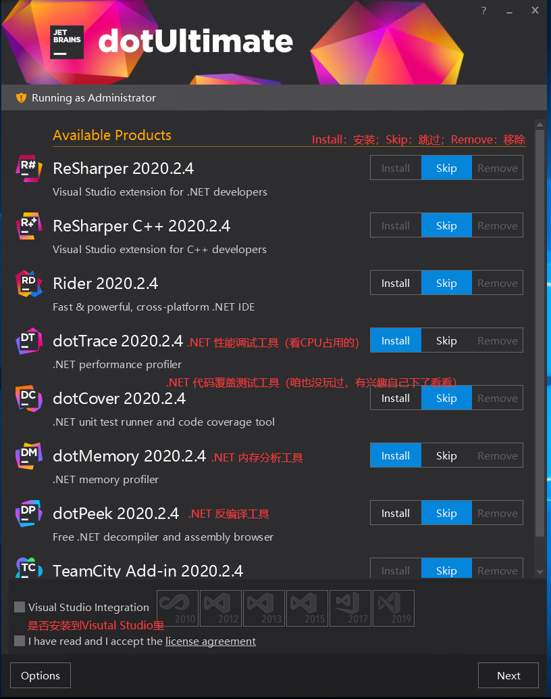
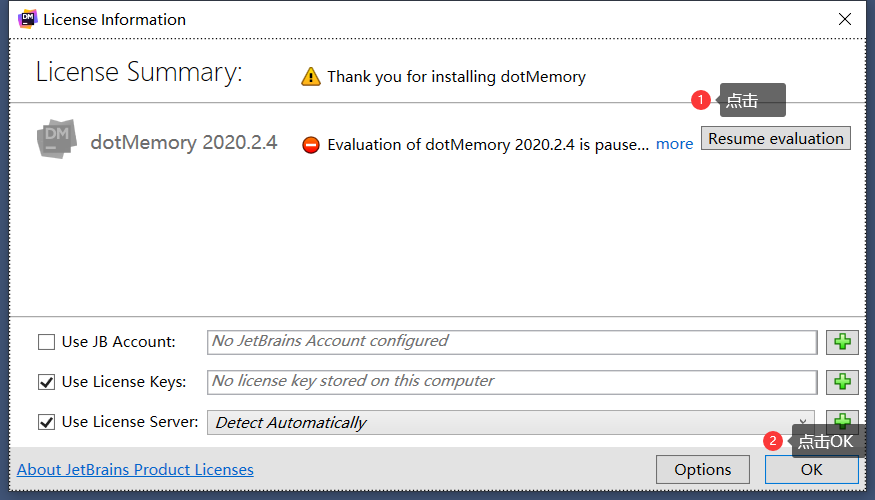
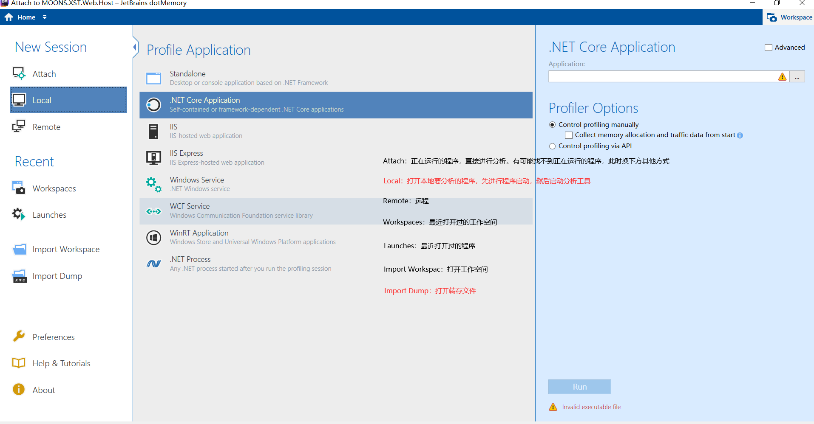
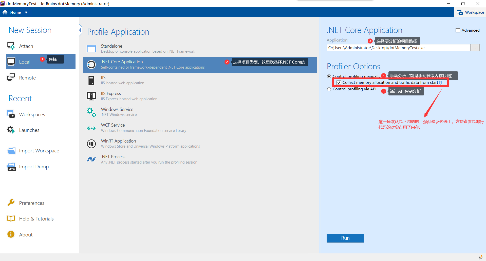
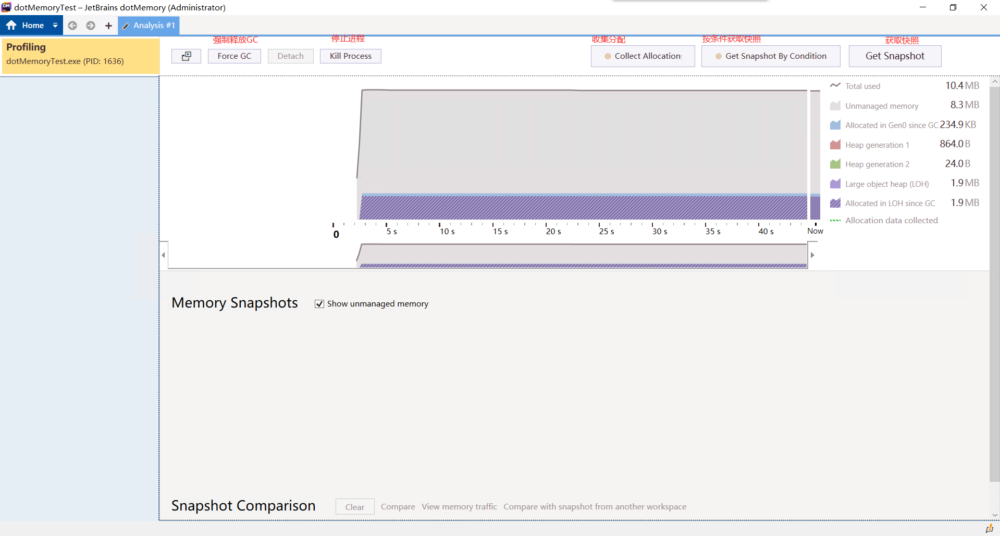
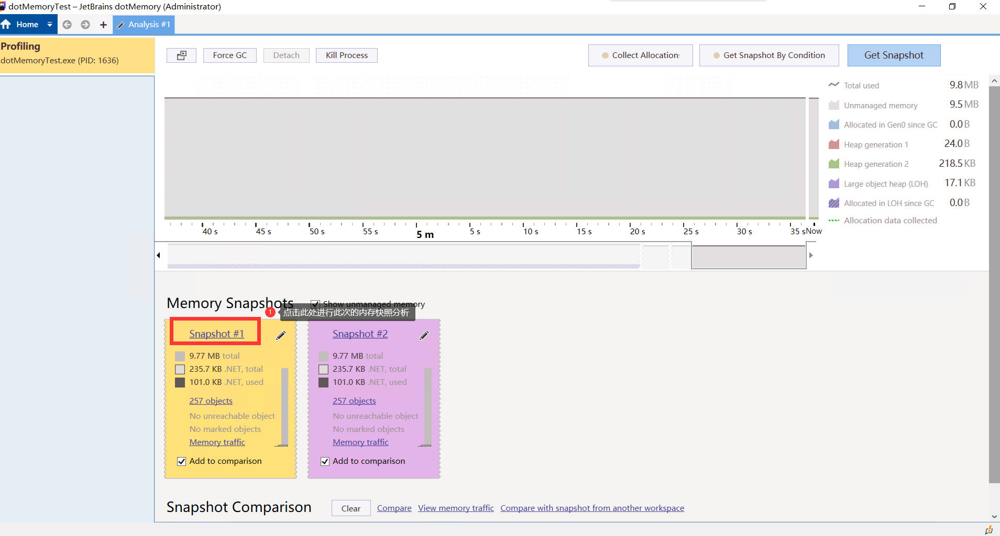
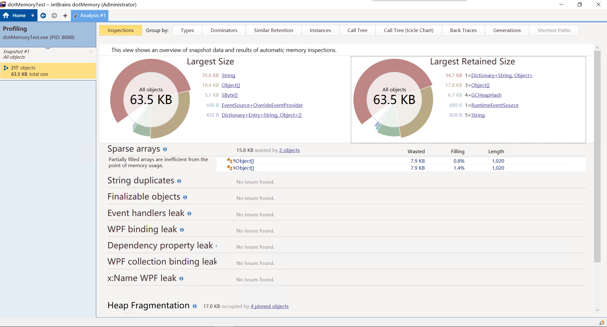
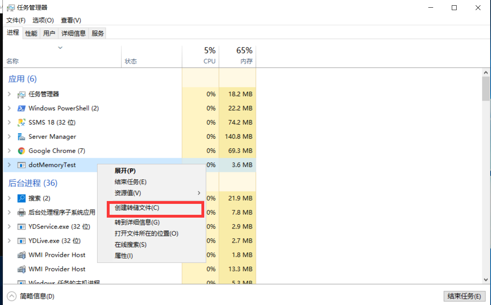
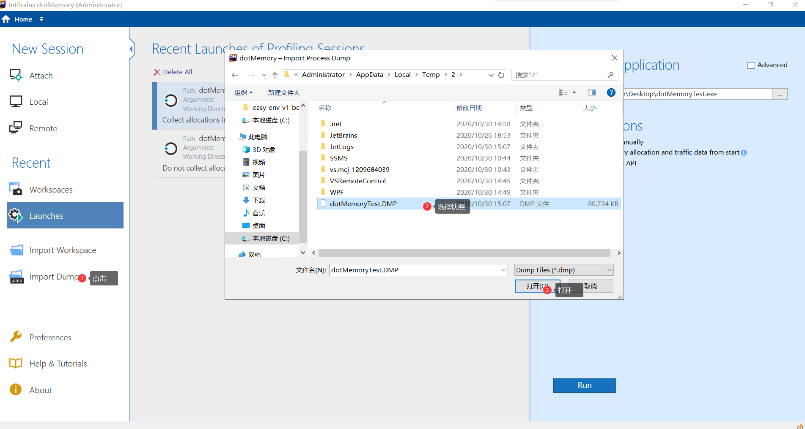

# .NET内存分析工具-dotMemory

## 1、介绍 
[官网链接](www.jetbrains.com)

#### 引言
程序内存占用较大？内存溢出？需要分析生产环境程序怎么办？

 dotMemory 使您可以分析各种 .NET 和 .NET Core应用程序的内存使用情况：桌面应用程序、Windows 服务、ASP .NET Web 应用程序、IIS、IIS Express、任意 .NET 进程等。

#### 效果

## 2、安装 
[安装链接](https://www.jetbrains.com/zh-cn/dotmemory/download/#section=web-installer)    

## 3、使用
安装完成后运行本次的主角：dotMemory

第一次运行会出现相应条款和账户登录，先不管它（有5天试用），直接点击`Resume evaluation`同意,下一步点击`OK`。

然后就进入dotMemory工具

这边重点介绍“Local”和“Import Dump”两种方式。“Local”：适合边运行边分析，我理解为==在线分析==；“Import Dump”适合于服务器不适合装软件（例如Linux环境），或者在生产环境上不适合安装软件,当您需要分析极大内存的时候，服务器内存不够时，我也建议您使用此方式，因为分析软件也需要占用系统资源，我理解为==离线分析==。

#### 3.1、Local 使用示例
##### 第一步：启动程序

##### 第二步：看到内存比较高了，就点击‘Get Snapshot’获取快照（可多次点击获取）,点击后页面下方会出现每次点击的快照

##### 第三步：进入分析界面

> 上图就是具体的分析界面了，大家自己多点点就明白了，其中“Gall Tree”就是要在启动的时候把‘Collect memory allocation and traffic data from start ’勾选上才可以查看的，这个功能建议开启，可以很方便的查看是哪行代码占用内存。
#### 3.2、Import 使用示例

“Import”方式主要是要生成转储文件Dump(理解为把内存里面存的东西放到一个文件里)，然后分析工具读取这个文件进行分析

##### 3.2.1 Windows创建内存转储
###### 第一步
打开‘任务管理器’，右击所要分析的程序，点击'创建转储文件'，复制文件路径。

> 另外通过命令行也可以方便的生成快照文件,Linux系统也是这样，[微软官方链接](https://docs.microsoft.com/zh-cn/dotnet/core/diagnostics/dotnet-dump)。
###### 第二步

> 然后就进入分析界面了，跟‘Local’方式进入的分析界面一样。  
##### 3.2.2 Linux创建内存转储
> 懒得写了，大佬请看官方文档 [微软官方链接](https://docs.microsoft.com/zh-cn/dotnet/core/diagnostics/dotnet-dump)。

### 鸣谢
[玩双截棍的熊猫](https://www.cnblogs.com/staneee/)

[初久的私房菜](https://www.cnblogs.com/MrChuJiu/)